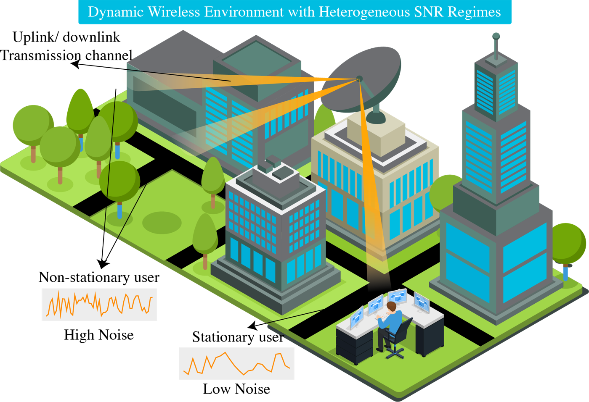
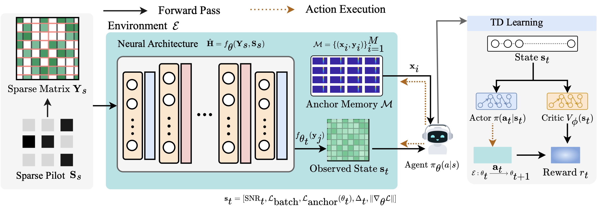
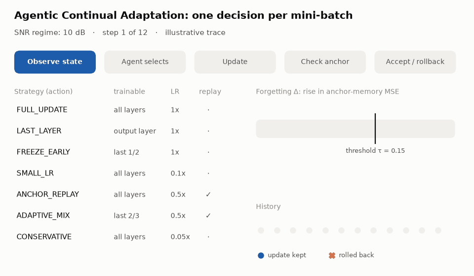

<div align="center">

# Agentic Continual Adaptation: Enabling Lifelong Learning in Wireless Channel Estimation

### 📡 Published in *IEEE Network* (2026) 📡

**Ahsan Bilal**<sup>1</sup>, **Muhammad Ahmed Mohsin**<sup>2</sup>, **Muhammad Umer**<sup>2</sup>, **Muhammad Ali Jamshed**<sup>3</sup>, **Ayesha Mohsin**<sup>4</sup>, **John M. Cioffi**<sup>2</sup>, **Dean F. Hougen**<sup>1</sup>

<sup>1</sup>University of Oklahoma &nbsp; <sup>2</sup>Stanford University &nbsp; <sup>3</sup>University of Glasgow &nbsp; <sup>4</sup>National University of Sciences and Technology

[](https://ieeexplore.ieee.org/document/11536171)
[](https://doi.org/10.1109/MNET.2026.3693331)
[](LICENSE)

[](https://www.python.org/)
[](https://pytorch.org/)
[](https://eprints.gla.ac.uk/390187/)

[**Method**](#how-aca-works) · [**Results**](#results) · [**Installation**](#installation) · [**Quick Start**](#quick-start) · [**Reproduce**](#reproducing-the-paper) · [**Citation**](#citation)

</div>

---

## 📢 News

- 📄 **Our paper is published in *IEEE Network*.** Read it on [IEEE Xplore](https://ieeexplore.ieee.org/document/11536171) (DOI: [10.1109/MNET.2026.3693331](https://doi.org/10.1109/MNET.2026.3693331)).
- 🚀 **Code released**: the full ACA framework (anchor memory, RL agent, rollback), the standard-training baseline, and the channel data pipeline.

---

> [!TIP]
> **TL;DR** A deep channel estimator trained at one SNR degrades when the SNR changes, and fine-tuning it on the new SNR makes it forget the old one. ACA trains **one** estimator across SNR regimes. Before every update, an RL agent picks how aggressively to adapt, and an anchor memory undoes any update that causes too much forgetting.

<div align="center">

| 📈 **4.3%** | 🎯 **13.6%** | ↩️ **7.5%** | 🧠 **1** |
|:---:|:---:|:---:|:---:|
| average gain in channel<br>estimation accuracy | peak gain, at<br>low SNR | of updates rolled back<br>by the forgetting check | estimator for all<br>10 SNR regimes |

</div>

This is the official code for **"Agentic Continual Adaptation: Enabling Lifelong Learning in Wireless Channel Estimation"** (*IEEE Network*, 2026).

As networks move toward 6G, deep-learning channel estimators face **distribution shift**: user mobility and changing SNR regimes push inputs away from the training distribution. Training sequentially on each new condition causes **catastrophic forgetting**. ACA casts continual learning as **reinforcement-based sequential decision-making** and combines three mechanisms:

1. **Anchor memory**: a small set of samples from earlier SNR regimes. The model is evaluated on it before and after every update to detect forgetting in real time.
2. **RL adaptation agent**: an actor-critic policy that picks one of **seven adaptation strategies** per update, trading plasticity against stability.
3. **Forgetting-aware rollback**: an update is rejected and the model is restored when forgetting exceeds an adaptive threshold.

<p align="center">
  
  <br>
  <em>Users in the same network see very different SNR regimes. One estimator should serve all of them without forgetting any.</em>
</p>

---

## How ACA Works

<p align="center">
  
  <br>
  <em><b>ACA framework.</b> Pilot observations are interpolated and refined by the channel estimator f<sub>θ</sub>. The agent π observes the training state, selects an adaptation action, and receives a reward that trades accuracy against forgetting. The agent is trained with actor-critic TD learning.</em>
</p>

Every mini-batch is one decision of the agent:

<p align="center">
  <picture>
    <source media="(prefers-color-scheme: dark)" srcset="assets/aca_loop_dark.gif">
    
  </picture>
  <br>
  <em>Illustrative trace. Each step: observe → select a strategy → update → measure forgetting on the anchor memory → keep or roll back.</em>
</p>

**State** $s_t$ (5-D): current batch MSE, anchor-memory MSE, progress through the SNR sequence, recent loss trend, and progress through the current regime's epochs.

**Actions**: the seven adaptation strategies, ordered from most plastic to most stable.

| # | Strategy | Trainable parameters | Learning rate | Anchor replay |
|:---:|---|---|:---:|:---:|
| 0 | `FULL_UPDATE` | all | 1× | |
| 1 | `LAST_LAYER` | output layer only | 1× | |
| 2 | `FREEZE_EARLY` | last half | 1× | |
| 3 | `SMALL_LR` | all | 0.1× | |
| 4 | `ANCHOR_REPLAY` | all | 0.5× | ✓ (loss = 0.7 current + 0.3 anchor) |
| 5 | `ADAPTIVE_MIX` | last two-thirds | 0.5× | ✓ |
| 6 | `CONSERVATIVE` | all | 0.05× | |

**Forgetting check and rollback**: after the update, forgetting is $\Delta = \text{MSE}_\text{anchor}^\text{after} - \text{MSE}_\text{anchor}^\text{before}$. If $\Delta > \tau$, the model is restored from the checkpoint taken just before the update. The threshold $\tau$ adapts to how well the anchor set is fit: 0.08 when anchor MSE < 0.001, the base value 0.15 up to 0.005, and 0.225 (capped at 0.30) above that.

**Reward**: $r_t = 10\,\big(-\text{MSE}_\text{batch} - 100\max(0,\Delta) - 0.01\,a_t\big)$, rewarding accuracy and penalizing forgetting and the cost of more complex actions.

**Agent training**: actor-critic with TD(0) targets ($\gamma = 0.95$), an entropy bonus, and ε-greedy exploration (ε = 0.2), updated every 64 decisions.

**Continual schedule**: the estimator visits SNR regimes 8 → 10 → 12 → 14 → 16 → 18 → 20 → 22 → 25 → 30 dB. After each regime, a few of its samples are added to the anchor memory by reservoir sampling, so later regimes are checked against all earlier ones.

---

## Results

Headline results from the paper, evaluated across ten SNR regimes (8–30 dB):

| Metric | Value |
|---|:---:|
| Average improvement in channel estimation accuracy | **4.3%** |
| Peak improvement (challenging low-SNR regimes) | **13.6%** |
| Parameter updates rejected by rollback | **7.5%** |

See the [paper](https://ieeexplore.ieee.org/document/11536171) for the full per-SNR results and the analysis of which strategies the agent learns to select.

---

## Paper-to-Code Map

| Paper component | Code |
|---|---|
| Anchor memory $\mathcal{M}$ (reservoir sampling, forgetting measurement) | `AnchorMemory` in [`aca_channel_estimation.py`](aca_channel_estimation.py) |
| RL agent $\pi_\theta(a \mid s)$ and critic $V_\phi(s)$ | `AdaptationAgent` in [`aca_channel_estimation.py`](aca_channel_estimation.py) |
| Seven adaptation strategies | `ACTIONS` and `ACATrainer.apply_adaptation_action` |
| Adaptive forgetting threshold | `ACATrainer.get_dynamic_threshold` |
| Checkpoint, forgetting check, rollback, reward | `ACATrainer.train_epoch` |
| Sequential multi-SNR training | `train_aca_channel_estimator` |
| Multi-SNR evaluation | `test_aca_model` |
| Channel estimators (SRCNN, DnCNN) | [`models.py`](models.py) |
| AWGN at a target SNR, pilot patterns, RBF/spline interpolation | [`channel_utils.py`](channel_utils.py) |
| Standard (non-agentic) training baseline | [`baseline_train.py`](baseline_train.py) |

---

## Repository Structure

```
.
├── aca_channel_estimation.py   # ACA: anchor memory, RL agent, trainer, train/test CLI
├── baseline_train.py           # Standard single-SNR training + cross-SNR evaluation
├── models.py                   # SRCNN and DnCNN channel estimators
├── channel_utils.py            # Data loading, AWGN, pilot interpolation, dataset building
├── requirements.txt
├── data/                       # Put Perfect_H_40000.mat here (see data/README.md)
├── docs/
│   └── customization.md        # Statistics, tuning, adding actions/state/reward, troubleshooting
└── assets/                     # README figures (make_figures.py regenerates the animation)
```

---

## Installation

```bash
git clone https://github.com/AhsanBilal7/agentic_wcp.git
cd agentic_wcp

conda create -n aca python=3.10 -y
conda activate aca

# Optional: install the PyTorch build for your CUDA version first (https://pytorch.org)
pip install -r requirements.txt
```

A CUDA GPU is recommended for training. Every script falls back to the CPU if CUDA is not available.

### Data

ACA uses the VehA channel dataset released with [ChannelNet](https://github.com/Mehran-Soltani/ChannelNet): 40,000 noiseless channel realizations, each an OFDM grid of **72 subcarriers × 14 symbols**.

1. Download **"Perfect channels – VehA model (without noise)"** ([Google Drive](https://drive.google.com/file/d/1H5GiEWITfM00R4BS2uC3SiBLR0EZKX8m/view?usp=sharing)).
2. Save it as `data/Perfect_H_40000.mat`, or point to it with `--data_path`.

Noisy inputs are generated on the fly. For each SNR, complex AWGN is added to the perfect channel, the grid is sampled at the pilot positions (48 pilots by default), and the full grid is recovered by Gaussian RBF interpolation. The estimator learns to map this coarse estimate to the perfect channel, with the real and imaginary parts as separate single-channel images.

---

## Quick Start

Train ACA across all ten SNR regimes, then evaluate at each one:

```bash
python aca_channel_estimation.py --mode both --model_type DNCNN
```

For a fast check that everything runs (two regimes, two epochs each):

```bash
python aca_channel_estimation.py --mode both --model_type SRCNN \
    --snr_list 8 22 --epochs_per_snr 2 --save_dir ./aca_checkpoints_debug
```

> [!NOTE]
> Building the inputs for one SNR interpolates 40,000 grids on the CPU, so each new regime starts with a few minutes of data preparation before the progress bar appears.

Outputs in `--save_dir` (default `./aca_checkpoints`):

| File | Contents |
|---|---|
| `aca_<MODEL>_snr<k>.pth` | Estimator and agent weights after training on regime *k* |
| `aca_<MODEL>_final.pth` | Final estimator and agent, with the SNR list, rollback rate, and action counts |
| `aca_<MODEL>_statistics.json` | Rollbacks, action distribution, per-epoch loss, and per-step forgetting/threshold/anchor MSE |
| `aca_<MODEL>_final_test_results.json` | Test MSE at each SNR |
| `aca_<MODEL>_final_performance.png` | Test MSE vs. SNR |

Evaluate an existing checkpoint only:

```bash
python aca_channel_estimation.py --mode test \
    --checkpoint_path ./aca_checkpoints/aca_DNCNN_final.pth
```

### Main options

| Flag | Default | Description |
|---|---|---|
| `--mode` | `both` | `train`, `test`, or `both` |
| `--model_type` | `DNCNN` | `SRCNN` or `DNCNN` |
| `--snr_list` | `8 10 12 14 16 18 20 22 25 30` | SNR regimes (dB), in training order |
| `--epochs_per_snr` | `50` | Training epochs per regime |
| `--forgetting_threshold` | `0.15` | Base rollback threshold τ |
| `--anchor_memory_size` | `256` | Anchor memory capacity |
| `--num_pilots` | `48` | Pilots per grid: 8, 16, 24, 36, or 48 |
| `--batch_size` / `--lr` / `--seed` | `128` / `1e-3` / `42` | Training settings |
| `--data_path` | `data/Perfect_H_40000.mat` | Perfect-channel file |
| `--save_dir` | `./aca_checkpoints` | Output folder |
| `--checkpoint_path` | `<save_dir>/aca_<MODEL>_final.pth` | Checkpoint for `--mode test` |
| `--device` | `cuda` | `cuda` or `cpu` |

---

## Reproducing the Paper

**ACA** (both estimators, ten regimes, 50 epochs each):

```bash
python aca_channel_estimation.py --mode both --model_type DNCNN
python aca_channel_estimation.py --mode both --model_type SRCNN
```

**Standard-training baseline.** Train SRCNN and DnCNN at a single SNR without the agent, then test them at every SNR to see how a fixed-SNR estimator degrades under SNR shift:

```bash
python baseline_train.py --train_snr 22 --epochs 300
```

Results go to `results/baseline/`: one checkpoint per model, `baseline_train22_results.json` with the MSE at each test SNR, and a plot. Use `--models`, `--test_snrs`, `--num_pilots`, and `--data_path` to change the setup.

Both scripts use seed 42. Evaluation regenerates AWGN at every test SNR with a fixed seed and scores a random 20% split.

To tune ACA, read the training statistics, or change its state, actions, or reward, see [**docs/customization.md**](docs/customization.md).

---

## Citation

If you find this work useful, please cite:

```bibtex
@article{bilal2026agentic,
  title   = {Agentic Continual Adaptation: Enabling Lifelong Learning in Wireless Channel Estimation},
  author  = {Bilal, Ahsan and Mohsin, Muhammad Ahmed and Umer, Muhammad and Jamshed, Muhammad Ali and Mohsin, Ayesha and Cioffi, John M. and Hougen, Dean F.},
  journal = {IEEE Network},
  year    = {2026},
  doi     = {10.1109/MNET.2026.3693331}
}
```

## Acknowledgements

The channel dataset, pilot interpolation, and SRCNN/DnCNN estimators follow [ChannelNet](https://github.com/Mehran-Soltani/ChannelNet) ([Soltani et al., *Deep Learning-Based Channel Estimation*, IEEE Communications Letters, 2019](https://arxiv.org/abs/1810.05893)). We thank the authors for releasing their data and code.

## License

This project is released under the [MIT License](LICENSE).

## Contact

For questions, please open an issue or email Ahsan Bilal at ahsan.bilal-1@ou.edu.
